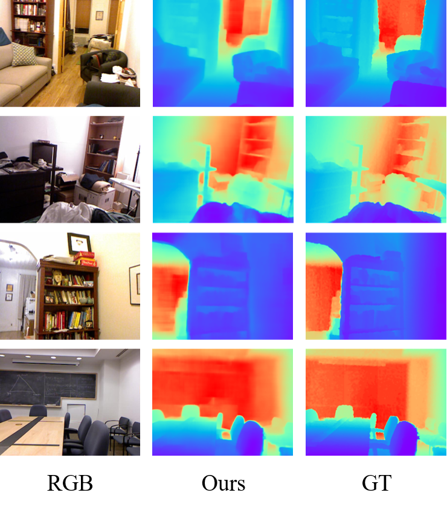

# Discrete-Representation-MDE

Please download the [testing set](https://cs.nyu.edu/~silberman/datasets/nyu_depth_v1.html#:~:text=The%20NYU-Depth%20data%20set%20is%20comprised%20of%20video,been%20preprocessed%20to%20fill%20in%20missing%20depth%20labels.) and [checkpoint](www.baidu.com)

# Test
`python predict.py`

# Training settings
- learning rate: 1.5 × 10−4
- batch size: 4
- weight decay: 5 × 10−4
- optimizer: [adamp](https://github.com/clovaai/AdamP)
- epoch: 120

# HVQ Architecture Settings:
- the size of HVQ: K=2048, D=128
- number of residual blocks: 1
- channel of the residual block: 64

# Vis

